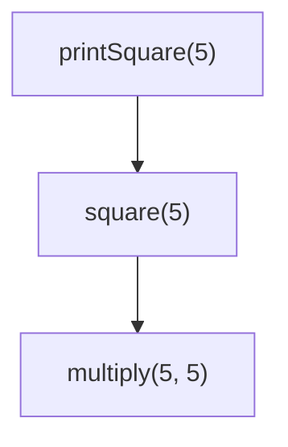
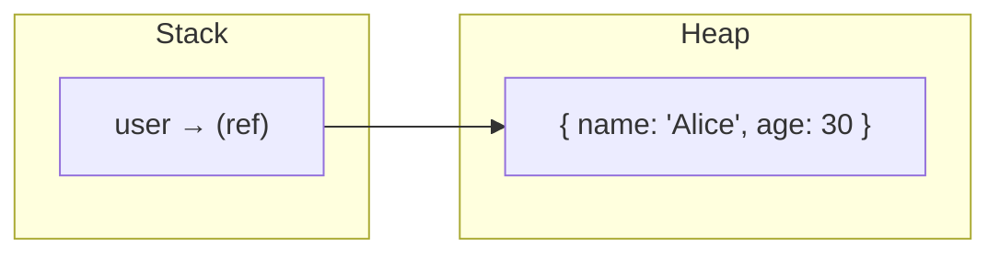
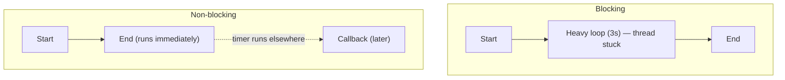
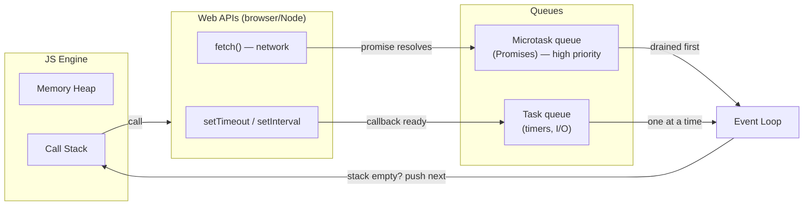

# JavaScript: Call Stack, Memory Heap, and the Event Loop

A simple guide to how JavaScript actually runs your code.

---

## 1. Call Stack

The call stack keeps track of **which function is currently running**. It's LIFO (Last In, First Out) — the last function pushed on is the first one popped off.



```js
function multiply(a, b) { return a * b; }
function square(n) { return multiply(n, n); }
function printSquare(n) { console.log(square(n)); }

printSquare(5);
```

Each call pushes a new frame. When a function returns, its frame pops off. Too many nested calls (e.g. infinite recursion) → **"Maximum call stack size exceeded."**

---

## 2. Memory Heap

The heap is where **objects, arrays, and functions** actually live. Variables on the stack just hold a *reference* (pointer) to the heap location.



- Primitives (numbers, strings, booleans) live directly on the stack.
- Objects/arrays live on the heap; the stack only holds a pointer.
- The **garbage collector** frees heap memory once nothing references it anymore.

---

## 3. Blocking vs Non-blocking Code

**Blocking**: code that hogs the single thread until it finishes — nothing else can run.

**Non-blocking**: slow work (timers, network, file I/O) gets handed off elsewhere, and the rest of your code keeps running.



```js
// Blocking
const start = Date.now();
while (Date.now() - start < 3000) {} // freezes everything

// Non-blocking
setTimeout(() => console.log("later"), 3000);
console.log("this runs first");
```

---

## 4. The Full Picture: JS Engine + Web APIs + Event Loop

JavaScript is single-threaded, but the browser (or Node) gives it extra machinery to handle async work *outside* the JS engine.



### How it works, step by step

```js
console.log("1");

setTimeout(() => console.log("2 - timeout"), 0);

fetch("/api/data").then(() => console.log("3 - fetch"));

console.log("4");
```

1. **Sync code runs directly** on the call stack (`"1"`, then later `"4"`).
2. **`setTimeout` is delegated** to the Web API — the timer counts down outside the JS engine. The stack is immediately free.
3. **`fetch()` is delegated** too — the network request runs outside the engine and returns a pending Promise right away.
4. **Sync code finishes**, call stack goes empty.
5. **Event loop checks the queues.** It always drains the **microtask queue completely first** — that's where resolved Promise callbacks go.
6. **Then it takes one task** from the task queue — that's where `setTimeout`/`setInterval` callbacks go — runs it, and repeats from step 5.

**Output:**
```
1
4
3 - fetch
2 - timeout
```

### The one rule to remember

> Promises (microtasks) always cut in line ahead of `setTimeout`/`setInterval` (macrotasks), every single time the call stack clears — no matter which finished first in real time.

---

## Quick summary

| Concept | What it is |
|---|---|
| Call stack | Tracks which function is currently running (LIFO) |
| Memory heap | Where objects/arrays actually live; stack holds references |
| Blocking | Code that halts everything until it's done |
| Non-blocking | Slow work is delegated, code keeps running |
| Web APIs | Browser/Node machinery that does async work outside the JS engine |
| Microtask queue | Promise callbacks — always drained first |
| Task queue | Timer/I/O callbacks — one runs per event loop cycle |
| Event loop | Moves queued callbacks onto the stack once it's empty |
